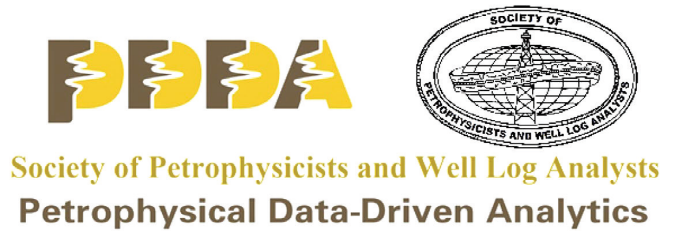

# 2021 SPWLA PDDA Machine Learning Competition
## Well-log based reservoir property estimation with machine learning

<!-- 
- <a>Call for Registration </a>
- <a>Sponsoring Opportunities</a>
- <a>Contest Committee</a>
- <a>Description</a>
- <a>Evaluation</a>
- <a>Timeline</a>
- <a>Competition Rules</a>
- <a>Prize Policy</a>
- <a>Leaderboard</a>
- <a>Data Licensing</a> -->

### Winner:
|           | Winner Team      | Contact |
|-----------|-------------|-----------|
| ***1st Place*** | **UTFE**        | Wen Pan <wenpan@utexas.edu> |
|                 |                 | Tianqi Deng <tianqizx@gmail.com> |
| ***2nd Place*** | **MoLPhy**       | István Szabó <ISzabo3@MOL.hu> |
| | | Pál Hanzelik <hanzelik.pal@gmail.com> |
| | | Csilla Kalmár <kalmarcsilla@gmail.com> |
| ***3rd Place*** | **Tomsk** | |
| ***4th Place*** | **Atwah_Analytics** | Saleh Alatwah <saleh.z.atwah@gmail.com> |
| ***5th Place*** | **Jaehyuk Lee**    | Jaehyuk Lee <Jaehyuk.Lee@bakerhughes.com> |

### Leaderboard
| Rank | Team Name              | Best Score | Best Solution        | Notebook                                                                                                                                                         |
|:----:|------------------------|------------|----------------------|------------|
|   1  | UTFE                   |  0.0525    | Linear Regression    | [Notebook](https://github.com/pddasig/Machine-Learning-Competition-2021/tree/main/solutions/UTFE_WELL_ADAPTION.ipynb) |
|   2  | MoLPhy                 |  0.0602    | Ensemble model  | [Notebook](https://github.com/pddasig/Machine-Learning-Competition-2021/tree/main/solutions/MoLPhy_PDDA_2021.ipynb) |
|   3  | Tomsk                 |  0.0634     | Neural network  | [Notebook](https://github.com/pddasig/Machine-Learning-Competition-2021/tree/main/solutions/Tomsk_Notebook.zip) |
|   4  | Atwah_Analytics       |  0.0667     | ExtraTree and Catboost regression  | [Notebook](https://github.com/pddasig/Machine-Learning-Competition-2021/tree/main/solutions/SPWLA_submission_AtwahAnalytics.ipynb) |
|   5  | Jaehyuk Lee           |  0.0775     | LightGBM  | [Notebook](https://github.com/pddasig/Machine-Learning-Competition-2021/tree/main/solutions/Jaehyuk_Lee_PDDA_2021_ML_competition_team_Jaehyuk_Lee.ipynb) |
|   6  | curioso       | 0.0833 | Neural network | [Notebook](https://github.com/pddasig/Machine-Learning-Competition-2021/tree/main/solutions/curioso_Tutorial-V15-submit.ipynb) |
|   7  | GGAIS         | 0.0975 | XGBoost | [Notebook](https://github.com/pddasig/Machine-Learning-Competition-2021/tree/main/solutions/GGAIS.zip) |
|   8  | Iron486       | 0.0982 | Neural network | [Notebook](https://github.com/pddasig/Machine-Learning-Competition-2021/tree/main/solutions/Iron486_1.ipynb) |
|   9  | VE4F          | 0.1006 | Regression boosted trees | [Notebook](https://github.com/pddasig/Machine-Learning-Competition-2021/tree/main/solutions/VE4F.zip) |
|   10 | dirtycats     | 0.1021 | Gradient boosting | [Notebook](https://github.com/pddasig/Machine-Learning-Competition-2021/tree/main/solutions/Dirtycats.zip) |
|   11 | DeepPlus      | 0.1053 | LightGBM | [Notebook](https://github.com/pddasig/Machine-Learning-Competition-2021/tree/main/solutions/DeepPlus.ipynb) |
|   12 | PDDA (Benchmark) | 0.11718 | Random Forest | [SPWLA_2021_ML_Tutorial.ipynb](https://github.com/pddasig/Machine-Learning-Competition-2021/blob/main/SPWLA_2021_ML_Tutorial.ipynb) |
|   13 | Geolatinas    | 0.1250 | Artificial neural network | [Notebook](https://github.com/pddasig/Machine-Learning-Competition-2021/tree/main/solutions/GeoLatinas_solution.ipynb) |
|   14 | Geo_ML        | 0.13071 | CatBoost | [Notebook](https://github.com/pddasig/Machine-Learning-Competition-2021/tree/main/solutions/Geo_ML_2.zip) |
|   15 | Team_Zotrex   | 0.3773 | Multilayer perceptron (MLP) |  |
| | | | |
|      | BroodingPixel | 0.0751 |  |  |
|      | GeoData       | 0.0779 |  |  |
|      | Emerson_BRASAR | 0.0782 |  |  |
|      | white_hats    | 0.0826 |  |  |
|      | PetroVirago   | 0.0830 |  |  |
|      | ThePandas     | 0.0839 |  |  |
|      | CUP_AI_Hogwarts | 0.0856 |  |  |
|      | BraveTeam       | 0.0920 |  |  |
|      | ML_developers_2022 | 0.0935 |  |  |
|      | CUP_AI_Bamboo | 0.0940 |  |  |
|      | PetroMachine  | 0.0942 |  |  |
|      | MachineLearningWhileDrilling | 0.0958 |  |  |
|      | Moyu          | 0.0961 |  |  |
|      | Lowest_RMSE   | 0.0977 |  |  |
|      | UESTC_BG      | 0.0988 |  |  |
|      | LEARNERS      | 0.0997 |  |  |
|      | Rocky-AI      | 0.1003 |  |  |
|      | Cup_Melon_Eaters | 0.1007 |  |  |
|      | EarthAnalyst  | 0.1008 |  |  |
|      | BHKU          | 0.1020 |  |  |
|      | Schooners     | 0.1025 |  |  |
|      | OxyPetroML    | 0.1030 |  |  |
|      | I.DesRochesBot	| 0.1062 |  |  |
|      | Bigdatalogging | 0.1089 |  |  |
|      | ProbePetrophysics | 0.1131 |  |  |
|      | Fourieous_Transformers | 0.1155 |  |  |
|      | North    | 0.1167 |  |  |
|      | ton_osk118    | 0.1172 |  |  |
|      | AI logging team | 0.1174 |  |  |
|      | outlier_detectives | 0.1175 |  |  |
|      | YYDS | 0.1326 |  |  |
|      | Quantum Energy | 0.2134 |  |  |
|      | Gen_Zheng_Miao_Hong_Team | 0.3149 |  |  |

### <a>Scoring website</a>
Please use the team leader's email to register. The link was sent in the email.

Please note that:
1. Only one user can register for the competition per team. 
2. __The user name has to be exactly the same as the team name__. If space is not allowed, please replace space with underscore '_'.
3. The submission file must be a zip file with whatever name. __However, the name of the csv file inside the zip has to be "submission.csv"__. (the csv file should be in the same format as “example_1.csv” file on the GitHub page in terms of number of columns and rows, as well as exactly the same column names) 
4. The submission status might need a couple minutes to be updated, don't refresh the page too often.
5. The user needs to manually submit their best results to the leaderboard. Click "Participate", " Submit / View Results", click the "+" symbol in your submission. See the red circles in the attached figure.
6. Please use version-control properly, as we need to validate your code and reproduce the results of the final submitted score in order to rank your team in the final scoreboard.  
7. Max submissions per day: 3
8. Max submissions total: 100

### <a>Contest Committee</a>
Lei Fu, Yanxiang Yu, Chicheng Xu, Michael Ashby, McDonald Andy, Bin Dai

<!-- #region -->
### <a>Description</a>
#### <a>Background</a>
Well logs are interpreted/processed to estimate the in-situ reservoir properties (petrophysical, geomechanical, and geochemical), which is essential for reservoir modeling, reserve estimation, and production forecasting. The modeling is often based on multi-mineral physics or empirical formulae. When sufficient amount of training data is available, machine learning solution provides an alternative approach to estimate those reservoir properties based on well log data and is usually with less turn-around time and human involvements.

#### <a>Problem Statement</a>
The goal of this contest is to develop data-driven models to estimate reservoir properties including shale volume, porosity, and fluid saturation, based on a common set of well logs including gamma ray, bulk density, neutron porosity, resistivity, and sonic.

You will be provided with log data from about 10 wells from the same field together with the corresponding reservoir properties estimated by petrophysicists. You need to build a data-driven model using the provided training dataset. Following that, you will deploy the newly developed data-driven models on the test dataset to predict the reservoir properties based on the well log data. 

### <a>Evaluation</a>
Submissions are evaluated according to root mean squared error(RMSE) calculated from the shale volume (VSH), porosity (PHIF), and water saturation (SW) values of the hidden dataset. The value of the hidden dataset is between 0 and 1.

- Here **\hat{y_i}** is the predicted values of the true values **y_i**. Both **\hat{y_i}** and **y_i** are vectors with 3 elements: shale volume (VSH), porosity (PHIF), and water saturation (SW). 
- m is sample size.

### <a>Timeline</a>

- __October 15, 2021__ - Registration deadline. You must email Lei Fu (pdda_sig@spwla.org) with team information (team name, member names, affiliations, and emails) before this date in order to compete.
- __November 1, 2021__ - Competition starts and data releases on github. 
- __February 1, 2022__ - Submission deadline. 
- __March 1, 2022__ - Announce winners.
- __March 23/24, 2022__ - Award ceremony and presentations in the special session of the SPWLA Spring Topical Conference - Petrophysical Machine Learning.

All deadlines are at 11:59 PM UTC on the corresponding day unless otherwise noted. The competition organizers reserve the right to update the contest timeline if they deem it necessary.

### <a>Competition Rules</a>

1. Contestant can be an individual or a group with the maximum size of 4.
2. The contest focuses on data-driven methods, the use of additional data or petrophysical equations is not allowed.
3. Privately sharing code or data outside of teams is not permitted. However, it's okay to share code if made available to all participants on the competition Github repository via submitting issues or pull requests. 
4. A contestant will submit the estimated reservoir properties for testing wells.
5. A contestant will submit the source code and a brief report documenting the accuracy achieved in a few plots.
6. The judges will review the source code.
7. The performance of the model will be quantified in terms of root mean square error (RMSE).
8. A leaderboard will be updating the rank of submissions from each team.
9. The contestant with the best quality source code and the best performance will be declared the winner for this competition.
    
### <a>Prize Policy</a>

- 1st Place - \$500  
- 2nd Place - \$400  
- 3rd Place - \$300   
- 4th Place - \$200   
- 5th Place - \$100   

Top 5 winning teams will be awarded with prizes(NOT in cash).

Note: The winners will additionally be required to provide a detailed description of their method in order to claim the prize (minimum of 2 pages double-column) by February 15, 2022, which is two weeks after the competition has concluded.

Novel and practical algorithms will be recommended for a submission to the a SPWLA special issue by PDDA or a journal paper. 
<!-- #endregion -->

### <a>Data Licensing</a>
The data comes from VOLVE dataset owned by Equinor. 

DATA ACCESS AND USE: Creative Commons Attribution-NonCommercial-ShareAlike license.

ENTRY IN THIS COMPETITION CONSTITUTES YOUR ACCEPTANCE OF THESE OFFICIAL COMPETITION RULES.

The Competition named above is a skills-based competition to promote and further the field of data science. You must submit your registration to pdda_sig@spwla.org to enter. Your competition submissions ("Submissions") must conform to the requirements stated on the Competition Website. Your Submissions will be scored based on the evaluation metric described on the Competition Website. Subject to compliance with the Competition Rules, Prizes, if any, will be awarded to participants with the best scores, based on the merits of the data science models submitted. Check the competition website for the complete Competition Rules.

### SPWLA PDDA SIG Contest Committee:
Lei Fu, Yanxiang Yu, Chicheng Xu, Andy McDonald,  Michael Ashby.

